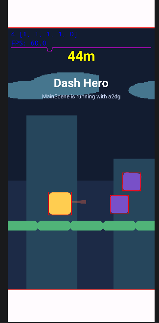
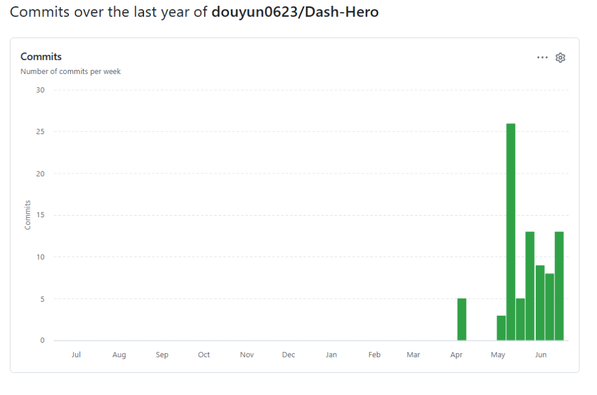

# Dash-Hero

## **프로젝트 관련 링크**

* **프로젝트 제목**: Dash Hero
* **Git Repository**: [GitHub 저장소 링크](https://github.com/douyun0623/Dash-Hero)
* **2차 발표 영상 자료**: [2차 발표 영상 링크](https://www.youtube.com/watch?v=qfScB1W2sp8)
* **2차 발표 버전 README.md**: [README.md 링크](https://github.com/douyun0623/Dash-Hero/blob/main/README.md)
* **1차 발표 영상 자료**: [1차 발표 영상 링크](https://youtu.be/XtZi-GZ4ehE)
* **1차 발표 버전 README.md**: [1차 발표 README.md](https://github.com/douyun0623/Dash-Hero/blob/035855e/README.md)

## **1. 게임 컨셉 (High Concept)**

* **High Concept**
  * **대시(Dash)** 와 **밟기(Stomp)** 를 통해 적을 밀어내며 전진하는 2D 러너 액션 게임입니다.
* **핵심 메카닉**
  * 화면 터치 시 전방으로 대시하여 적을 강하게 밀쳐냅니다.
  * 낙하 중 적의 머리를 밟으면 반동 점프로 다시 떠오릅니다.
  * 패턴 문자열 기반의 발판 생성으로 무한히 이어지는 지형을 구성합니다.
  * 대시 중에는 리본 형태의 **Dash Trail** 이펙트가 생겨 속도감을 보강합니다.

## **2. 개발 범위 및 현재 진행 상황**

### **[캐릭터 및 애니메이션]**

| 항목 | 진행률 | 현재 구현 |
| --- | ---: | --- |
| 플레이어 캐릭터 | 85% | 자동 점프, 터치 대시, 대시 중 Y축 고정, 복귀 보간 구현 |
| 상태별 시각 피드백 | 65% | 일반, 웅크림, 대시 상태별 색과 크기 변화 구현 |
| Dash Trail | 75% | 꼬리 같은 잔상 효과 구현 |

### **[물리 및 충돌 시스템]**

| 항목 | 진행률 | 현재 구현 |
| --- | ---: | --- |
| Velocity Control | 80% | 중력, 점프 속도, 대시 이동, 복귀 보간 적용 |
| Collision Handling | 45% | 밟기, 대시 타격, 일반 충돌 분기 구현. 다만 판정 안정화 필요 |
| 게임오버 판정 | 70% | 적 옆면 충돌, 화면 아래 추락 시 GAME_OVER 상태 전환 |

### **[적 및 지형 환경]**

| 항목 | 진행률 | 현재 구현 |
| --- | ---: | --- |
| 무한 발판 생성 | 80% | `PlatformManager`가 `"XXXX---XXX"` 형태의 패턴 데이터로 발판 생성 |
| 안전 구간 | 70% | 초반 5개 이상 발판 이후부터 적 스폰 |
| 적 시스템 | 70% | 점프하는 적, 대시 피격, 밟기 반동 구현 |
| 배경 스크롤 | 80% | 대시 기준선을 넘으면 배경과 발판이 부드럽게 이동 |
| Object Lifecycle | 70% | 화면 밖 발판과 적을 리스트에서 제거 |

### **[UI 및 게임 루프]**

| 항목 | 진행률 | 현재 구현 |
| --- | ---: | --- |
| 거리 점수 | 70% | 이동 거리를 m 단위로 표시 |
| 상태 머신 | 75% | `RUNNING`, `GAME_OVER` 상태 분리 |
| 재시작 | 80% | GAME_OVER 상태에서 터치 시 `SceneStack.change()`로 즉시 재시작 |

## **3. 예상 게임 실행 흐름**



* **게임 시작**: `MainActivity`가 `MainScene`을 생성하고 게임이 바로 시작됩니다.
* **인게임**: 캐릭터는 자동으로 점프하며, 화면을 터치하면 오른쪽으로 대시합니다.
* **월드 진행**: 플레이어가 기준 위치를 넘어가려 하면 플레이어는 화면 안에 유지되고, 배경과 발판이 왼쪽으로 이동합니다.
* **전투 액션**
  * 대시 중 적과 충돌하면 적이 회전하며 화면 밖으로 날아갑니다.
  * 적의 머리를 밟으면 플레이어가 다시 튀어 오릅니다.
  * 일반 상태에서 적의 옆면과 부딪히면 게임오버가 됩니다.
* **결과 화면**: 게임오버 시 점수를 표시하고, 터치하면 즉시 재시작합니다.

## **4. 8주 상세 개발 일정**

| 주차 | 기간 | 개발 목표 및 상세 내용 |
| :---: | :---: | :--- |
| **1주차** | **04/05 ~ 04/11** | 1차 발표 README 작성, 게임 컨셉 정리 |
| **2주차** | **04/12 ~ 04/18** | 수업 프레임워크 구조 분석, a2dg 적용 방식 검토 |
| **3주차** | **04/19 ~ 04/25** | Android 프로젝트 생성 준비, 프로젝트 구조 계획 |
| **4주차** | **04/26 ~ 05/02** | MainActivity, Scene, World 구조 적용 계획 |
| **5주차** | **05/03 ~ 05/09** | Android 프로젝트 생성, a2dg 모듈 연결, MainScene 초기 구성 |
| **6주차** | **05/10 ~ 05/16** | 자동 점프, 대시, 배경 스크롤, Dash Trail, PlatformManager, 적 상호작용, 점수 UI 구현 |
| **7주차** | **05/17 ~ 05/23** | 충돌 판정 안정화, 발판 패턴 다양화, 적 배치 조정 |
| **8주차** | **05/24 ~ 05/30** | 최종 디버깅, 사운드/타격 피드백 추가, 발표 영상 정리 |

## **5. Git Commit 활동**



| 주차 | 기간 | Commit 수 | 주요 작업 |
| :---: | :---: | ---: | :--- |
| **1주차** | **04/05 ~ 04/11** | 5 | 1차 발표 README 및 초기 문서화 |
| **2주차** | **04/12 ~ 04/18** | 0 | 구조 검토 중심 |
| **3주차** | **04/19 ~ 04/25** | 0 | 구현 방식 검토 |
| **4주차** | **04/26 ~ 05/02** | 0 | 프로젝트 생성 준비 |
| **5주차** | **05/03 ~ 05/09** | 3 | Android 프로젝트 생성, a2dg 모듈 연결, MainActivity 연결 |
| **6주차** | **05/10 ~ 05/16** | 16 | MainScene, 플레이어, 대시, 스크롤, Dash Trail, PlatformManager, 적, 점수 UI|

## **6. Activity 구성**

```text
MainActivity
└─ BaseGameActivity 상속
   ├─ 디버그 그리드, FPS, 디버그 정보 설정
   ├─ GameMetrics 크기 설정: 900 x 1600
   └─ createRootScene()에서 MainScene 생성
```

`MainActivity`는 Android 앱의 진입점입니다. 수업에서 만든 `BaseGameActivity`를 상속하고, `createRootScene()`에서 `MainScene`을 만들어 게임을 시작합니다.

## **7. Scene 구성 및 전환 관계**

```text
앱 실행
└─ MainActivity.createRootScene()
   └─ MainScene
      ├─ RUNNING
      └─ GAME_OVER
          └─ 화면 터치 시 SceneStack.change(MainScene(gctx))로 재시작
```

현재는 별도의 TitleScene이나 ResultScene을 만들지 않고, `MainScene` 내부의 `State` enum으로 게임 흐름을 제어합니다. 게임오버 상태에서 터치하면 `SceneStack.change()`를 통해 `MainScene`을 새로 생성합니다.

## **8. MainScene의 Game Object 구성**

### **Player**

| 구분 | 내용 |
| --- | --- |
| class 구성 정보 | 둥근 사각형 캐릭터. 일반, 대시, 웅크림 상태에 따라 색과 크기 변화 |
| 동작 구성 | 자동 점프, 대시, 중력, 발판 충돌, 복귀 보간, 밟기 반동 점프 |
| 상호작용 정보 | 발판에 착지, 적을 밟으면 `bounce()`, 대시 중 적과 충돌하면 적 제거, 일반 충돌 시 게임오버 |
| 핵심 코드 | `updateWithCollision()`, `dash()`, `bounce()`, `clampForwardLimit()` |

### **PlatformManager**

| 구분 | 내용 |
| --- | --- |
| class 구성 정보 | `GroundPlatform`과 `Enemy` 리스트를 관리하는 맵 관리자 |
| 동작 구성 | 문자열 패턴을 따라 발판을 생성하고, 화면 밖 객체를 제거 |
| 상호작용 정보 | 플레이어와 적이 착지할 발판을 찾을 때 사용 |
| 핵심 코드 | `spawnNext()`, `scrollBy()`, `getPlatformAt()`, `updateEnemies()` |

### **GroundPlatform**

| 구분 | 내용                                    |
| --- |---------------------------------------|
| class 구성 정보 | 초록색 직사각형 발판                           |
| 동작 구성 | 월드 스크롤에 따라 왼쪽으로 이동                    |
| 상호작용 정보 | 플레이어와 적의 착지 기준면 제공                    |
| 핵심 코드 | `scrollBy()`, `isOffScreen()`, `topY` |

### **Enemy**

| 구분 | 내용 |
| --- | --- |
| class 구성 정보 | 보라색 둥근 사각형 적. 사망 시 회전하며 날아감 |
| 그림 구성 | `Canvas.drawRoundRect()`로 그리며, `DEAD` 상태에서는 `canvas.rotate()`로 회전 연출을 적용 |
| 동작 구성 | `ALIVE` 상태에서는 발판 위에서 점프하고, `DEAD` 상태에서는 속도와 중력으로 화면 밖으로 날아감 |
| 상호작용 정보 | 대시 충돌 시 `die()`, 머리를 밟히면 플레이어 반동 점프, 옆면 충돌 시 게임오버 |
| 핵심 코드 | `updateWithCollision()`은 발판 착지와 점프를 처리하고, `die()`는 피격 후 속도와 회전 속도를 설정하며, `getBoundingBox()`는 충돌 판정 범위를 반환 |

### **DashTrail**

| 구분 | 내용                                                                 |
| --- |--------------------------------------------------------------------|
| class 구성 정보 | 꼬리 같은 대시 잔상 효과                                                     |
| 동작 구성 | 대시 중 플레이어 뒤쪽으로 길어지고, 대시 종료 후 꼬리가 회수됨                               |
| 상호작용 정보 | 플레이어 대시 상태와 위치를 받아 시각 효과를 표시                                       |
| 핵심 코드 | `start()`, `setHead()`, `setTail()`, `finish()`, `drawFlagTrail()` |

### **DashScrollBackground**

| 구분 | 내용 |
| --- | --- |
| class 구성 정보 | `bg_dash_city.png` 기반 수평 스크롤 배경 |
| 동작 구성 | 대시 진행에 맞춰 배경을 왼쪽으로 이동 |
| 상호작용 정보 | 직접 충돌은 없고 진행감 제공 |
| 핵심 코드 | `scrollBy()` |

## **9. 구현하면서 어려웠던 점**

가장 어려웠던 부분은 **플레이어 복귀와 월드 스크롤 보간**입니다. 플레이어가 대시로 기준 위치를 넘었을 때는 플레이어를 화면 안에 유지하면서, 초과 이동량만큼 배경과 발판을 왼쪽으로 이동시켜야 했습니다.

처음에는 기준 위치를 넘는 순간 배경과 발판을 바로 이동시켰기 때문에 화면 전환이 끊겨 보이거나, 대시 후 플레이어가 원래 위치로 돌아오는 동작이 어색했습니다. 그래서 플레이어의 화면 위치, 실제 이동량, 배경과 발판의 스크롤 양을 함께 계산하고, 복귀와 스크롤에 보간을 적용해 더 부드럽게 보이도록 조정했습니다.
